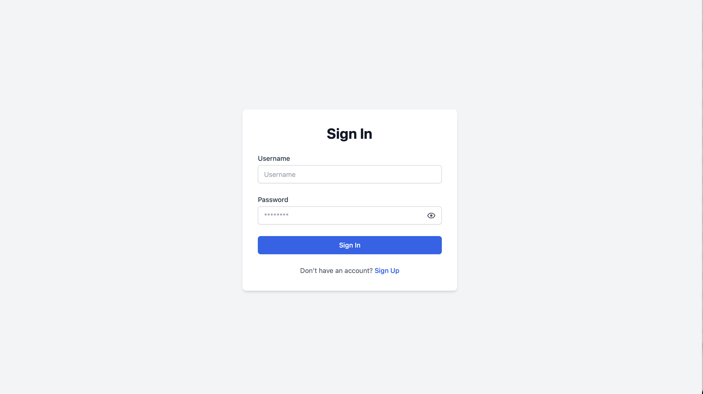
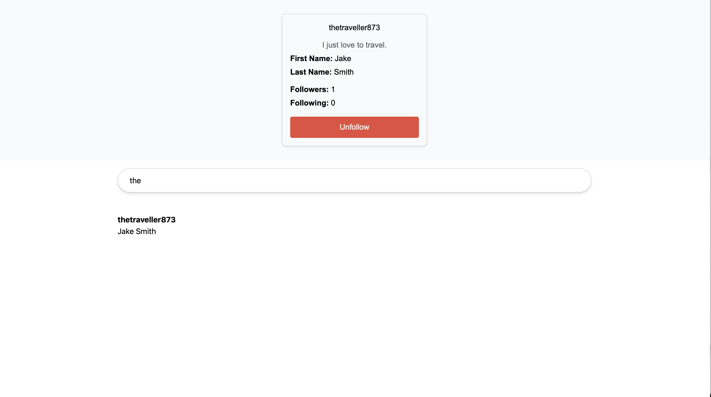

# Account System

Welcome to the Account System Backend and Frontend! This repository now contains the backend for a full-stack account management system **and a very basic NextJS frontend app**. The NextJS app serves as a starting point for integrating a complete user interface with the backend services.

## Overview

This project is built with Django for the backend and NextJS for the frontend. It is designed to demonstrate:
- **Dockerization:** Run the backend easily with Docker.
- **Database Integration:** A robust account system backed by a PostgreSQL database (with SQLite for testing).
- **Testing:** Comprehensive unit tests using Pytest.
- **Modern Dependency Management:** Managed with Poetry.
- **NextJS Frontend:** A basic NextJS app that interfaces with the backend API.

The backend features user account management, user profiles, and follow relationships between accounts, while the NextJS app provides a simple UI to get started.

## Technologies Used

- **Django:** The primary web framework.
- **Django REST Framework:** For building a RESTful API.
- **NextJS / React:** For the basic frontend application.
- **PostgreSQL / SQLite:** For database storage (PostgreSQL in production; SQLite for testing).
- **Docker & Docker Compose:** For containerization and deployment.
- **Poetry:** For dependency management.
- **Pytest:** For unit testing.

## Frontend: NextJS App

A very basic NextJS application has been added to the repository. It is designed as a starting point to interact with the backend API and can be expanded in the future.

### Getting Started with the NextJS App

1. **Prerequisites:**
   - [Node.js 14+](https://nodejs.org/en/download/)

2. **Navigate to the Frontend Directory:**
   ```bash
   cd frontend
   ```

3. **Install Dependencies:**
   ```bash
   npm install
   ```

4. **Run the Development Server:**
   ```bash
   npm run dev
   ```

The app should now be running at http://localhost:3000.

### Example Screenshot
Here's a preview of the basic NextJS app interface:





### Running the Project Outside of Docker

1. **Clone the repository:**

   ```bash
   git clone https://github.com/yourusername/account-system-backend.git
   cd account-system-backend
   ```

2. **Install dependencies with Poetry (including development dependencies):**

   ```bash
   poetry install --with dev
   ```

3. **Environment variables:**

    Environment variables have been pushed in the repo for ease of use.


4. **Activate virtual environment:**

   ```bash
   source .venv/bin/activate
   ```

5. **Run the tests:**

   ```bash
   pytest
   ```

### Running the Project with Docker

   ```bash
   docker compose up --build
   ```

## Future Plans

- Frontend: A frontend application (React/Vue/Angular) will be added shortly.
- Additional Features: Enhanced user management, social features, and more.


## License

This project is licensed under the MIT License.


